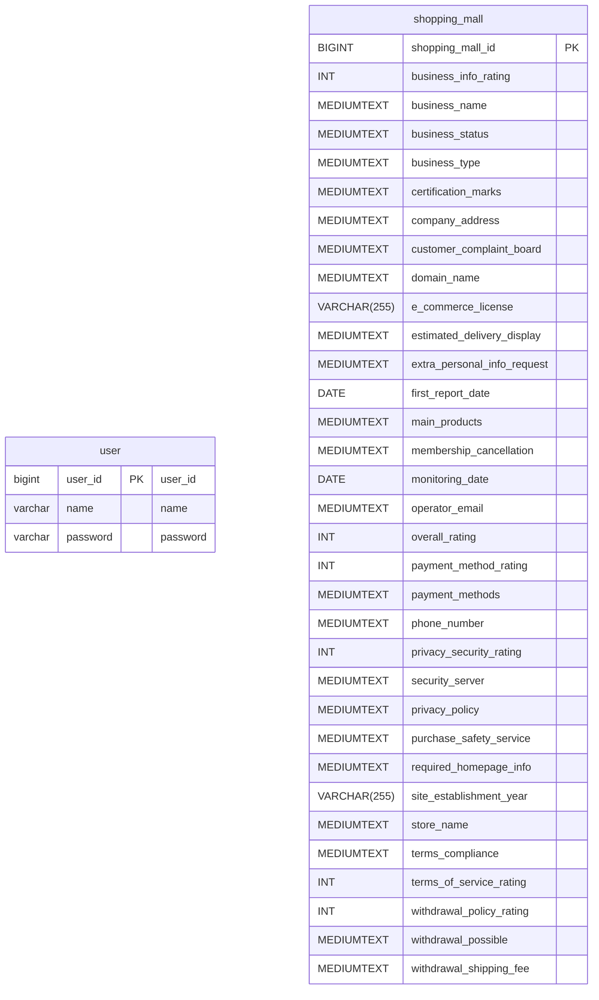

# dream_stadium

# 고객이 경기장 예매에 불편함을 겪지 않도록 만든 개인 프로젝트

## ◽ 프로젝트 정보
- 고객이 경기장 예매에 불편함을 겪지 않도록 만든 프로젝트 입니다. 개인 프로젝트에서는 팀 프로젝트와 달리 실제 환경에 가까운 조건을 만들기 위해 DBeaver, JMeter, JWT, Spring Security를 적용하여 여러 사용자가 동시에 요청을 보내는 상황을 시뮬레이션했고, 성공적으로 테스트를 마쳤습니다.
- 또한 Docker Compose, EC2, GitHub Actions를 활용해 CI/CD 환경을 구축하며 배포 자동화까지 구현했습니다.

## 🚀 주요 기능
- 좌석 예매
- spring security를 이용한 로그인
- 간단한 알람 기능
- 쿠폰기능
- docker-compose 적용 및 CI/CD 파이프라인 구현
- 부하 테스트

## 🔧 사용 기술

   
  
  
  
  
  
  
  
  
  
  
  
  
  
  

## ⏰ 프로젝트 기간
2025.08.11 ~ 2025. 09. 03 (약 3주 +a)

## 🧑‍💻 팀원 소개
| 이름       | 역할   | 담당 업무                  |
|-----------|--------|-------------------------|
| 김현준      |  팀장 | 전체기능| 

## 🔗 와이어프레임
[와이어 프레임 링크] https://www.figma.com/design/XfzXpl6Q6GOpBJrvhrFGiW/Untitled?node-id=0-1&p=f&m=draw
## 💻 ERD

## 📑 API 명세서
### 1. 회원 관련 API 
  - /auth<dr>
#### AuthController
| 기능       | Method   | URL              | Request | Response |
|-----------|----------|------------------|---------|--------|
| 회원 가입    | `POST`  | /auth/sign-up    | Body   | 201 Create | 
| 로그인      | `POST`  | /auth/log-in      | Body    | 200 OK |

### 2. 쇼핑몰 관련 API
- /shopping-mall<dr>
#### ShoppingMallController
| 기능       | Method   | URL              | Request | Response |
|-----------|----------|------------------|---------|--------|
| 전체 평점 및 업체 상태 리스트 조회   | `GET`  | /shopping-mall/status-ratings   | param   | 200 OK | 
| 페이지네이션 적용 리스트 조회 | `GET`  | /shopping-mall/status-ratings/page/{page}     | param    | 200 OK | 
| 커서 기반 페이지네이션 적용 리스트 조회| `GET`  | /shopping-mall/status-ratings/cursor-page   | param    | 200 OK |
| CSV 파일 업로드 및 데이터 저장    | `POST`  | /shopping-mall/collection    |     | 200 OK | 

---
## 📜 트러블 슈팅
- [CSV파일 한글 깨짐 현상](https://wax-drop-ff7.notion.site/CSV-193f00cdce4c80cc810fee84e97d2b42)
- [‘MysqlDataTruncation’ 오류 해결 과정](https://wax-drop-ff7.notion.site/MysqlDataTruncation-193f00cdce4c8061a26ad1c43691c5d4)
